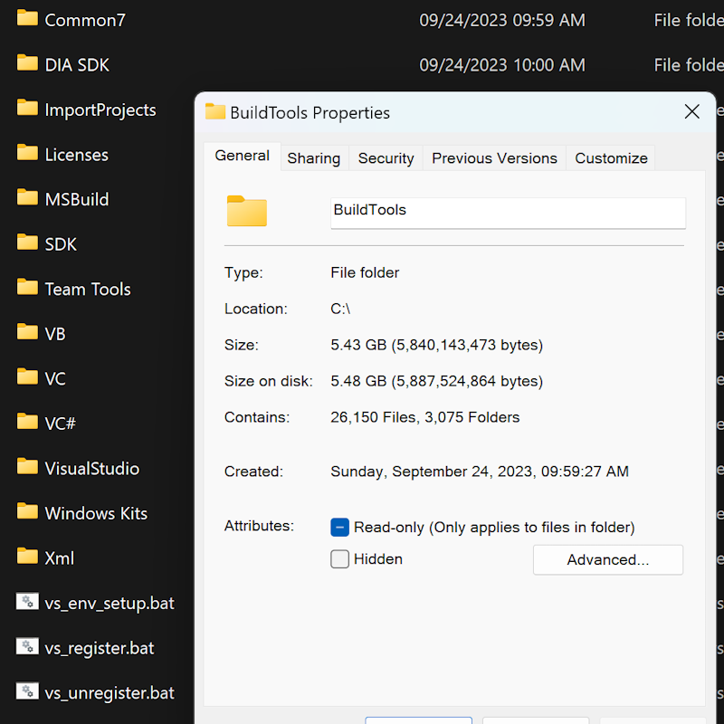

# BuildToolsInspector
Portable packages inspector (and downloader) for VS Build Tools.

### Why Did I Make This?
Originally, I only needed the build tools because it is required by Flutter. I don't like installing VS directly because of its size and the installation is not fully transparent (will mess up my file associations, require admin rights, etc). So I tried [PortableBuildTools](https://github.com/Data-Oriented-House/PortableBuildTools), but it still doesn't meet the Flutter requirement and doesn't have much customization. I checked the Flutter doctor source code to see what's wrong and it's [more complicated than I thought](https://github.com/flutter/flutter/blob/master/packages/flutter_tools/lib/src/windows/visual_studio.dart).

~~Currently, this tool still doesn't achieve what it's intended to do, but I think some people might want to check it. It consumes much of my free time so I'm not sure if I can finish it (especially the file extraction part). PR(s) are always welcome and I will see what I can do to help.~~ It's not perfect but it's done. PRs welcome.

### Disclaimer
- I don't know much about C/C++ and Visual Studio, all I care is to build a desktop app using Flutter (without installing Visual Studio)
- This tool is unofficial and there's no guarantee that everything will continue to work properly
- By using this tool you agree that I'm not responsible for anything and you're ready to accept any risk
- If something is broken (when parsing/downloading packages), start looking at [Visual Studio Bootstrapper Docs](https://github.com/MicrosoftDocs/visualstudio-docs/blob/main/docs/install/command-line-parameter-examples.md) and/or this [simple wiki](_docs/WIKI.md) I made.

### Features
- No need to install Visual Studio
- Ability to use specific build tools versions (e.g. `VS 2022`)
- Customize workloads (e.g. `Desktop development with C++`, `.NET desktop development`)
- Filter packages based on preferred arch and language (e.g. `X64`, `en-US`)
- Remove unneeded packages or add packages that are not included in workloads
- Check package types, total files, and download size
- Download and verify files checksum (or just export the details as `csv` and `json`)
- Extract downloaded files for portable installation (currently support `vsix` and Windows SDK)
- Can be recognized by `vswhere` (will write some values to Windows registry). Please modify path(s) on `state.json` manually when moving root directory

**Note:** There are many variables that can be customized within the script. The most important ones are located at the beginning (`vs_package_extract`, `vs_package_win_sdk`, etc). Please include your variable modifications when posting issue so I can investigate it more easily.

### Todo
|Status|Task|Comment|
|-|-|-|
|:white_check_mark:|Extract vsix files|There are some tiny vsix files that can't be extracted (because there's nothing to extract?), but I think they're not important at all so it's safe to ignore
|:white_check_mark:|Extract Windows SDK files|Currently done by temporarily installing Windows SDK (`WinSdkInstaller`)|
|:white_check_mark:|Set environment variables and registry keys|Done, as minimal as possible. There might be issues depending on how your software detect Visual Studio installation|
|:white_check_mark:|Compatibility with Flutter|Run `flutter clean`, `flutter run --verbose`, and check `CMakeConfigureLog.yaml` in case of error. It's also possible to change error verbosity by running CMake/MSBuild (with modified params) manually|
|:white_check_mark:|Compatibility with `vswhere`|Will need to copy `vswhere` to `%PROGRAMFILES(X86)%\Microsoft Visual Studio\Installer`. It's recognized correctly, but some tools like CMake may also use multiple COM interfaces to detect VS instances. COM query is barely supported because I'm not familiar with it|
|:white_large_square:|Migrate to PowerShell and don't use `cmd` tools (`reg`, `setx`, etc)|`cmd` is very unpredictable. It doesn't support single quotes and has multiple escape characters (`%`, `\`, `^`). Path with spaces and backslash at the end of path may also break things. And if that's not enough, the executed `bat` file may behave differently than when running the commands on `cmd` directly|
|:white_large_square:|Linux support|May need to use `pathlib` and change Windows SDK extract method. Even then, it may still be impossible to compile things correctly on Linux (missing dependencies, etc)|
|:white_large_square:|Use pure Python and remove external libraries|Not top priority, already possible to convert `ipynb` to `py`. Will need to implement our own `CaseInsensitiveDict` or always use `lower`|

### Screenshots

    
Show screenshots (may be outdated)

    

        
        
        
        
        
        
    

### Similar Projects
- [Data-Oriented-House/PortableBuildTools](https://github.com/Data-Oriented-House/PortableBuildTools)
- [mmozeiko/portable-msvc](https://gist.github.com/mmozeiko/7f3162ec2988e81e56d5c4e22cde9977) (gist)
- [reksar/vsget](https://github.com/reksar/vsget)

### License
- BuildToolsInspector under [The Unlicense](LICENSE)
- Visual Studio under [Microsoft License](https://visualstudio.microsoft.com/license-terms/)